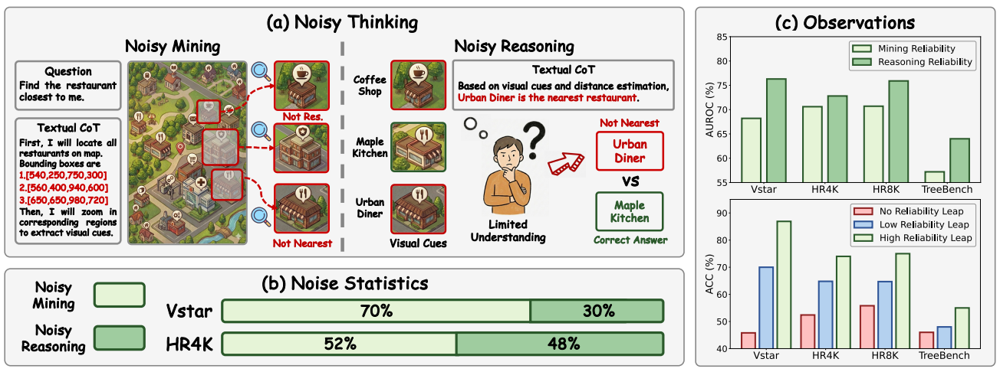
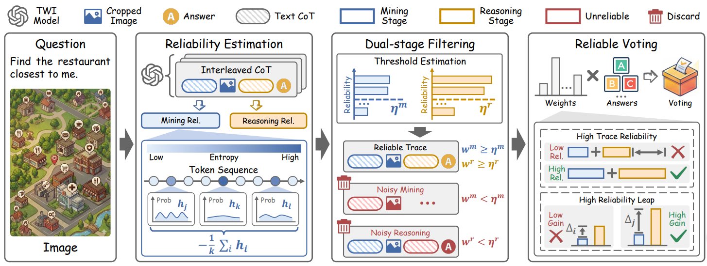

# Reliable Thinking with Images

> Haobin Li, Yutong Yang, Yijie Lin, Xiang Dai, Mouxing Yang, Xi Peng, Reliable Thinking with Images, ICML 2026. 👉 [[paper]](https://arxiv.org/abs/2602.12916)

## 📚 Background

Thinking with Images ([**OpenAI o3**](https://openai.com/zh-Hans-CN/index/thinking-with-images/)) has emerged as a dominant paradigm for enhancing the reasoning capabilities of Multimodal Large Language Models (MLLMs). This shift signifies that MLLMs no longer rely on text-based Chain-of-Thought (CoT). Instead, they have learned to act like detectives, tackling complex visual question answering tasks by generating interleaved image-text CoTs through two core stages:

Cue Mining: scrutinize complex images and extract critical visual cues with textual instructs.

Answer Reasoning: interconnect visual cues and derive the final answer step-by-step with textual CoT.


## 📌 Challenge

However, the success of existing TWI methods heavily relies on the assumption that interleaved image-text CoTs are faultless, which is easily violated in real-world scenarios due to the Noisy Thinking problem.

Noisy Thinking (NT) refers to the imperfect visual cues mining and answer reasoning process. 

As the saying goes, ``One mistake leads to another'', erroneous interleaved CoT would cause error accumulation, thus significantly degrading the performance of MLLMs.




## 💡 Contribution

- Pioneer the exploration of NT in TWI, revealing its negative impacts from the perspective of reasoning reliability.
- Estimate visual and textual reliability through a unified text-centric mechanism and then reveal **Reliability Correlation** and **Reliability Leap** in TWI. Based on these insights, a plug-and-play TTS framework is developed for achieving robustness against NT.
- The proposed method not only enhances answer accuracy in offline inference, but also enables reliable early stopping during online inference, boosting inference efficiency.




## 🛠️ Requirements & Installation

The environment setup for this project is based on [DeepConf](https://github.com/facebookresearch/deepconf) and [Qwen3-VL](https://github.com/QwenLM/Qwen3-VL).


## 📊 Datasets & Models

### Benchmarks

The reasoning benchmarks used in this study can be obtained from the following official repositories:

* **VStar**: [VStar Bench](https://huggingface.co/datasets/craigwu/vstar_bench) 📂
* **HR-Bench**: [HR-Bench](https://huggingface.co/datasets/DreamMr/HR-Bench) 📂

### Models

We evaluate the RTWI framework utilizing the State-of-the-Art TWI model, **Qwen3-VL**. You can download the **Thinking-enabled variants** from the [Qwen3-VL Collection](https://huggingface.co/collections/Qwen/qwen3-vl) on Hugging Face.

| Model Series | Variant       | Download                                                    |
| :----------- | :------------ | :---------------------------------------------------------- |
| **Qwen3-VL** | `8B-Thinking` | [HF Link](https://huggingface.co/Qwen/Qwen3-VL-8B-Thinking) |
| **Qwen3-VL** | `4B-Thinking` | [HF Link](https://huggingface.co/Qwen/Qwen3-VL-4B-Thinking) |
| **Qwen3-VL** | `2B-Thinking` | [HF Link](https://huggingface.co/Qwen/Qwen3-VL-2B-Thinking) |


## 🖥️ Evaluation

We provide two evaluation modes: a **Simple Evaluation** for rapid reproducibility using off-the-shelf traces, and a **Comprehensive Evaluation** for full-scale benchmarking of your own models.

### 🚀 Simple Evaluation

To facilitate reproducibility, we provide **off-the-shelf reasoning traces** generated by Qwen3-VL-8B-Thinking. You can download these traces from the following mirrors:

* **Baidu Network Disk**: [Download Link](https://pan.baidu.com/s/1QnasKfy-8Rv7eXqOhyDkqA) (Password: `abcd`)
* **Google Drive**: [Download Link](https://drive.google.com/drive/folders/1_3QYWld5FuAh5UzJ3RIcRuFBRi0E0Ye_?usp=drive_link)

Once downloaded, you can run the evaluation in either online or offline settings:

```python
# Online setting
python simple_evaluation/online_evaluation.py --filepath your-json-path

# Offline setting
python simple_evaluation/offline_evaluation.py --filepath your-json-path
```

### 📈 Comprehensive Evaluation

For a full-scale evaluation of Qwen3-VL model, use the `main.py` entry point. This mode supports detailed benchmarking across various datasets and subsets.

#### **Run Online Evaluation**

```python
python main.py --mode online --dataset vstar --subset Attr --model your-model --model_dir your-model-path --dataset_path ./dataset/vstar_bench
```

#### **Run Offline Evaluation**

```python
python main.py --mode offline --dataset vstar --subset Attr --model your-model --model_dir your-model-path --dataset_path ./dataset/vstar_bench
```

#### **📂 Supported Datasets & Subsets**

We currently support the following benchmarks for evaluating multimodal reasoning:

| --dataset   | --subset                                       |
| ----------- | ---------------------------------------------- |
| **vstar**   | `Attr`, `Spatial`                              |
| **hrbench** | `HR4K-FCP`, `HR4K-FSP`, `HR8K-FCP`, `HR8K-FSP` |

For more advanced configurations (e.g., hyper-parameters), please refer to `./RTWI/config.py`.


## 📝 Citation

If you find our work or the RTWI benchmark useful, please consider citing our paper:

```latex
@inproceedings{li2026reliable,
  title={Reliable Thinking with Images},
  author={Li, Haobin and Yang, Yutong and Lin, Yijie and Xiang, Dai and Yang, Mouxing and Peng, Xi},
  booktitle={International Conference on Machine Learning},
  year={2026}
}
```
